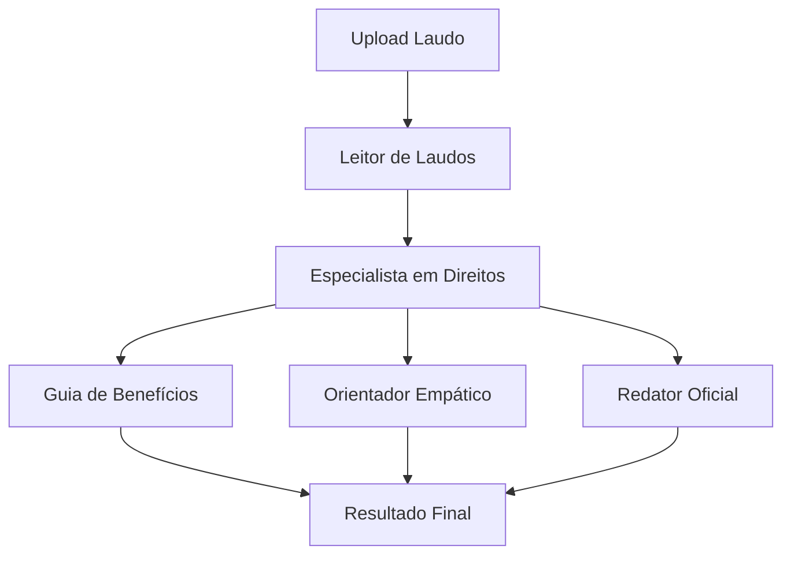

# 🦋 AMPARA - Assistente Inteligente para Mães Atípicas

## 📋 Visão Geral

O **AMPARA** é um sistema multiagente de IA criado para ajudar mães de crianças autistas a entender e acessar direitos, benefícios e apoios educacionais no Brasil.

### 🎯 Objetivo

A partir do upload ou descrição de um laudo de autismo, o sistema gera automaticamente:
1. ✅ Resumo das principais informações (CID, idade, nível de suporte, tipo de escola)
2. ✅ Lista de benefícios e direitos aplicáveis
3. ✅ Checklist detalhado com documentos, etapas e links oficiais
4. ✅ Cartas e e-mails formais prontos para enviar
5. ✅ Explicações empáticas e acessíveis, sem jargões jurídicos

---

## 🤖 Arquitetura Multiagente

O sistema é composto por 5 agentes especializados que trabalham em conjunto:

### 1. 🩺 Leitor de Laudos (`ReportReaderAgent`)
**Função:** Extrair dados relevantes do texto do laudo médico

**Tecnologia:** Gemini 2.0 Flash (temperature: 0.3)

**Saída:**
```typescript
{
  cid: "F84.0",           // Código CID
  age: 5,                  // Idade
  supportLevel: "Leve",   // Nível de suporte
  schoolType: "publica",  // Tipo de escola
  observations: "..."      // Observações resumidas
}
```

**Características:**
- ✅ Extrai apenas dados relevantes (sem dados pessoais)
- ✅ Identifica CID, idade, nível de suporte
- ✅ Retorna formato estruturado

---

### 2. ⚖️ Especialista em Direitos (`RightsSpecialistAgent`)
**Função:** Identificar benefícios e direitos aplicáveis

**Tecnologia:** Gemini 2.0 Flash (temperature: 0.5)

**Benefícios Disponíveis:**
- BPC/LOAS (Benefício de Prestação Continuada)
- Passe Livre Intermunicipal
- Passe Livre Municipal
- Isenção de IPVA
- Professor de Apoio (AEE)
- Medicamentos pelo SUS
- Terapias pelo SUS (CAPS)
- Isenções Fiscais (IR)
- Cartão de Estacionamento Especial
- Prioridade em Filas

**Características:**
- ✅ Ordena por prioridade (alta, média, baixa)
- ✅ Filtra benefícios baseado no perfil do laudo
- ✅ Personaliza descrições com IA

---

### 3. 📋 Guia de Benefícios (`GuideAgent`)
**Função:** Criar checklists detalhados passo a passo

**Tecnologia:** Checklists pré-configurados

**Saída:** Lista de itens com:
- Título da etapa
- Descrição breve
- Detalhes completos
- Status de conclusão

**Características:**
- ✅ Checklists específicos para cada benefício
- ✅ Instruções detalhadas e práticas
- ✅ Tom instrutivo e acolhedor

---

### 4. ✍️ Redator Oficial (`OfficialWriterAgent`)
**Função:** Gerar textos formais e personalizados

**Tecnologia:** Gemini 2.0 Flash (temperature: 0.7)

**Tipos de Documentos:**
- **Requirement** - Requerimento administrativo
- **Email** - E-mail formal
- **Letter** - Carta à escola
- **Petition** - Petição administrativa

**Características:**
- ✅ Formato padrão brasileiro
- ✅ Tom respeitoso e objetivo
- ✅ Dados do laudo integrados

---

### 5. 💛 Orientador Empático (`EmpathicGuideAgent`)
**Função:** Traduzir informações técnicas para linguagem humana

**Tecnologia:** Gemini 2.0 Flash (temperature: 0.8)

**Saídas:**
- Explicações empáticas sobre benefícios
- Mensagens de encorajamento passo a passo
- Apoio emocional personalizado

**Características:**
- ✅ Linguagem simples e acessível
- ✅ Tom acolhedor e encorajador
- ✅ Valida emoções e sentimentos

---

## 🔄 Fluxo de Processamento



### Etapas:
1. **Análise do Laudo** - Extrai CID, idade, nível de suporte
2. **Identificação de Benefícios** - Lista aplicáveis ordenada por prioridade
3. **Geração de Conteúdo**:
   - Checklist detalhado
   - Explicação empática
   - Documentos oficiais (para benefícios prioritários)
4. **Apoio Emocional** - Mensagem de encorajamento personalizada

---

## 📦 Estrutura de Arquivos

```
lib/
├── agents/
│   ├── report-reader.ts       # 🩺 Leitor de Laudos
│   ├── rights-specialist.ts   # ⚖️ Especialista em Direitos
│   ├── guide-agent.ts         # 📋 Guia de Benefícios
│   ├── official-writer.ts     # ✍️ Redator Oficial
│   └── empathic-guide.ts      # 💛 Orientador Empático
├── ampara-orchestrator.ts     # 🎼 Orquestrador Principal
└── ...

app/api/
└── process-report/
    └── route.ts               # Endpoint API
```

---

## 🚀 Como Usar

### Via API

```typescript
POST /api/process-report

{
  "reportText": "Laudo médico de autismo..."
}

Response:
{
  "success": true,
  "data": {
    "reportSummary": {...},
    "applicableBenefits": [...],
    "emotionalSupport": "..."
  }
}
```

### Exemplo de Integração

```typescript
import { AmparaOrchestrator } from "@/lib/ampara-orchestrator"

const orchestrator = new AmparaOrchestrator(process.env.API_KEY)
const result = await orchestrator.processReport(laudoTexto)
```

---

## ⚡ Configuração

### Variáveis de Ambiente

```env
NEXT_PUBLIC_GOOGLE_API_KEY=sua-api-key-aqui
```

### Instalação

```bash
npm install
# ou
pnpm install
```

---

## 🛡️ Conformidade LGPD

✅ **Não armazena dados pessoais**
- Apenas extrai informações técnicas relevantes (CID, idade)
- Não guarda nomes, endereços ou outros dados pessoais
- Processamento é stateless (não persiste dados)

✅ **Transparência**
- Usuária tem controle total sobre os dados
- Pode processar anonimamente

✅ **Ética**
- Tom empático e respeitoso
- Foco em empowerment e apoio

---

## 🎨 Características Especiais

### Tom Empático
- Linguagem simples e acolhedora
- Valida sentimentos e emoções
- Encorajamento contínuo

### Personalização
- Checklists adaptados ao benefício
- Explicações baseadas no perfil do laudo
- Documentos oficiais personalizados

### Conformidade Legal
- Baseado em leis brasileiras
- Referências à Lei de Inclusão
- Formato administrativo correto

---

## 📊 Benefícios Cobertos

| Benefício | Tipo | Prioridade | Checklist | Documentos |
|-----------|------|------------|-----------|------------|
| BPC/LOAS | Federal | Alta | ✅ | ✅ |
| Passe Livre Intermunicipal | Federal | Alta | ✅ | ✅ |
| Passe Livre Municipal | Municipal | Média | ✅ | - |
| Isenção IPVA | Estadual | Média | ✅ | - |
| Professor de Apoio (AEE) | Legal | Alta | ✅ | ✅ |
| Medicamentos SUS | Federal | Alta | ✅ | - |
| Terapias SUS | Federal | Alta | ✅ | - |
| Isenções Fiscais | Federal | Média | ✅ | - |
| Cartão Estacionamento | Municipal | Baixa | ✅ | - |
| Prioridade em Filas | Legal | Baixa | ✅ | - |

---

## 🧪 Testes

### Exemplo de Laudo de Teste

```text
LAUDO MÉDICO

Paciente: [Nome]
Idade: 5 anos
CID: F84.0 (Transtorno do Espectro Autista - Nível Leve)

O paciente apresenta características compatíveis com Transtorno do Espectro Autista (TEA), 
nível de suporte 1 (requer suporte leve). Apresenta dificuldades na comunicação social e 
interação social, com interesses restritos e comportamentos repetitivos.

Estuda atualmente em escola pública do município.

Recomendações: Necessita acompanhamento multidisciplinar e suporte educacional especializado.

Dr. [Nome do Médico]
CRM: XXXXX
```

---

## 📝 Licença

Projeto desenvolvido para hackathon social de impacto social.

---

## 💙 Contribuindo

Este é um MVP em desenvolvimento. Sugestões e melhorias são bem-vindas!

**Foco em:**
- Ética e empatia
- Acessibilidade
- Conformidade legal
- Impacto social positivo

---

## 📞 Suporte

Para dúvidas ou sugestões sobre o sistema AMPARA, abra uma issue no repositório.

---

**Criado com 💙 para mães de crianças autistas no Brasil**
